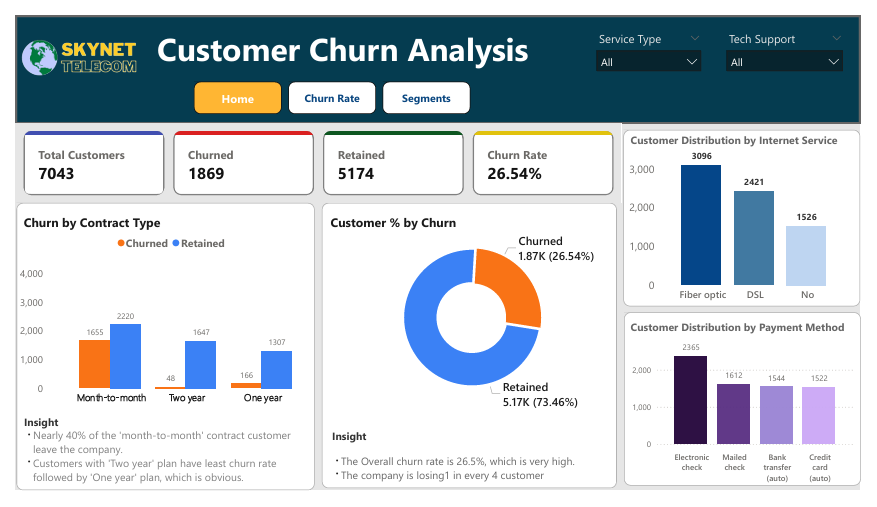
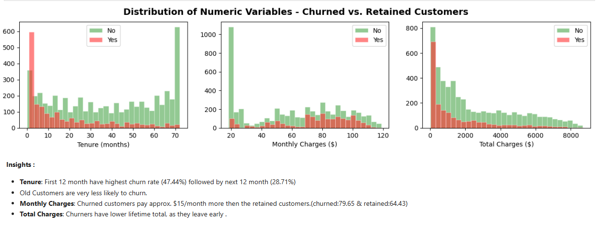

<p align="center">
  
</p>

# Telecom Customer Churn Analysis

## Objective
The objective of this project is to analyze customer churn data from SkyAir Telecom, identify the key factors driving customer churn, understand high-risk customer segments, and provide actionable business recommendations to improve customer retention.

## Project Background
SkyAir Telecom is a telecommunications company that provides mobile network, broadband internet, and digital services. across the United States. Over the years, the company has experienced increasing competition in the telecom industry, leading to a rising customer churn rate.

To better understand these challenges, the company hired a Data Analyst to examine customer demographics, subscribed services, contract types, billing methods, and monthly charges in order to identify the key factors contributing to customer churn.

### Business Questions
- What factors influence customer churn?
- Which customer segments are most at risk of churn?
- How do services, contracts, and billing methods affect churn behavior?
- What strategies can help improve customer retention?

---

## Dataset Information
The dataset contains customer-level information for SkyAir Telecom customers, including- 
- Demographics (gender, senior citizen, dependents)
- Services subscribed (internet service, online security, tech support, etc.)
- Account details (contract type, tenure)
- Billing information (monthly charges, total charges, payment methods)
- Customer churn status (Yes/No)

### Featured Notebooks/Deliverables
- [Notebook](notebooks/telc-customer-churn.ipynb)
- [Dashboard](dashboards/customer-churn-analysis.pbix)

### Tools Used
- Python (Pandas, NumPy, Matplotlib, Seaborn) for Data Cleaning, Exploratory Data analysis (EDA), and Visualization
- Jupyter Notebook
- MySQL for data querying and structured analysis
- Power BI for interactive dashboards and visual insights

### Steps: (Jupyter Notebook)
1. Importing Libraries and Loading Data
2. Basic Data Insepcting
3. Data Cleaning and Preprocessing
4. Exploratory Data Analysis
5. Churn Rate Analysis by Segments
6. Final Insights and Recommendataions

---
### Dashboard Preview 


---
### Notebook Preview 


---
## Summary and Final Insights

#### KEY NUMBERS

- **Total Customers:** 7,043  
- **Churned Customers:** 1,869 (**26.54%**)  
- **Retained Customers:** 5,174 (**73.46%**)  

>  **Churn rate of 26.54% is critically high** — the company is losing **~1 in every 4 customers**

---

### High-Risk Segments at a Glance

1. Month-to-month contracts -> **42.7% churn** (3,875 customers)
2. Fiber optic subscribers -> **41.9% churn** (3,096 customers)
3. Electronic check payers -> **45.3% churn** (2,365 customers)
4. New customers first 12 month -> **47.7% churn** (2,175 customers)
5. Senior citizens -> **41.7% churn** (1,142 customers)
6. No Tech Support -> **41.6% churn** (3,473 customers)

### Main Churn Drivers
1. **Tenure** -> short tenure means very high risk
2. **Contract Type** -> month-to-month is danger zone
3. **Online Security** & **Tech Supoort** -> without these services churn doubles
4. **Payment Method** -> manual payment means more likely to churn

---
### Insights 
1. **Key Insights**
   
    - Overall churn rate is **26.54%**, meaning the company is losing **~1 in 4 customers**, which is significantly high.  
    - Churned customers pay **~$15 more per month** (79.65 vs 64.43), indicating higher price sensitivity.  
    - First-year customers have the highest churn (**~47.5%**), which drops to **28.7%** in the second year.

    <br>  
2. **Contract Type**
    - Month-to-Month customers have the highest churn (**42.71%**), which is **~15× higher than two-year contracts (2.83%)** and **~4× higher than   one-year contracts (11.27%)**.  
    - Over **50% of the customer base** is on Month-to-Month plans, increasing overall churn risk.
      
    <br>
3. **Internet Service**
    - Fiber optic customers churn at **41.89%**, which is more than **2× DSL customers**.  
    - Fiber is a **premium, high-revenue service**, and nearly half of customers use it—making this a critical risk area.
    <br>
4. **Payment Method**
    - Electronic check users have the highest churn (**45.3%**), nearly **3× higher than auto-pay users (~16%)**.  
    - Customers using **manual payment methods** (electronic or mailed checks) churn more than those on automatic payments.
    <br>
5. **Customer Tenure**
    - **47.5% of customers churn within the first year**, meaning 1 in 2 customers leaves early.  
    - The second year still shows relatively high churn (**28.7%**).  
    - Churn rate **consistently decreases with increasing tenure**, indicating stronger retention over time.
    <br>
6. **Other Services**
    - Customers without **tech support** have a higher churn rate (**41.64%**).  
    - Customers without **online security** have a higher churn rate (**41.77%**).  
    - No Tech supoort/ No Online Security -> **high churn risk segment**.
    <br>
7. **Demographics**
    - **Senior citizens** have higher churn (**41.68%**).  
    - Senior customers without tech support have **~2.5× higher churn** than those with support.  
    - **Single customers (32.96%)** and customer with **no dependents (31.28%)** churn more.  
    - Gender have almost zero effect on churn.
   
--- 
## RECOMMENDED ACTIONS

1) **CONTRACT CONVERSION**
   Try to convert month-to-month customers to switch to annual plans.
   We can offer discounts, or small benefits to push them toward 1-year or 2-year contracts.
   

2) **FIBER OPTICS  SERVICE**
    Fiber customers generate high revenue but also have very high churn (41.9%), so it is a risky segment.
    We should check service quality (speed, downtime, reliability) and collect customer feedback to find issues
    We can also give extra benefits like OTT subscriptions (movies/TV) to fiber optics customers.


3) **Payment Method**
   Customers using manual payment(like electronic check) have very high churn.
   We should encourage them to switch to auto-pay by giving small discounts or cashback.
   Auto-pay makes payment easier and reduces chances of churn.

4) **Tech Support and Online Security**
    Customers without tech support or online security have high churn (~41%).
    We can bundle these services with plans or give a free 3–6 month trial.

5) **Early Customer Retention**
    Around 47% customers churn in the first year, which is very high.
    We should focus on new customers by giving early support, and regular follow-ups.
   
6) **Senior Citizen Programme**
    Senior customers have higher churn (~41%).
    We can provide dedicated support, simple billing, and technical help for them.


# Repository Structure

```bash
├── data/
├── notebooks/
├── sql_queries/
├── dashboard/
├── images/
└── README.md
```
